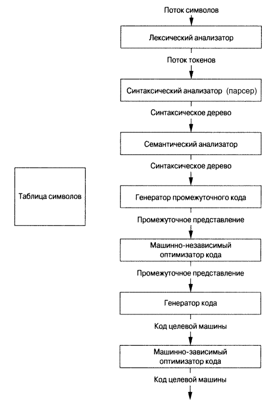
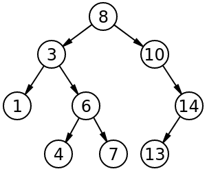
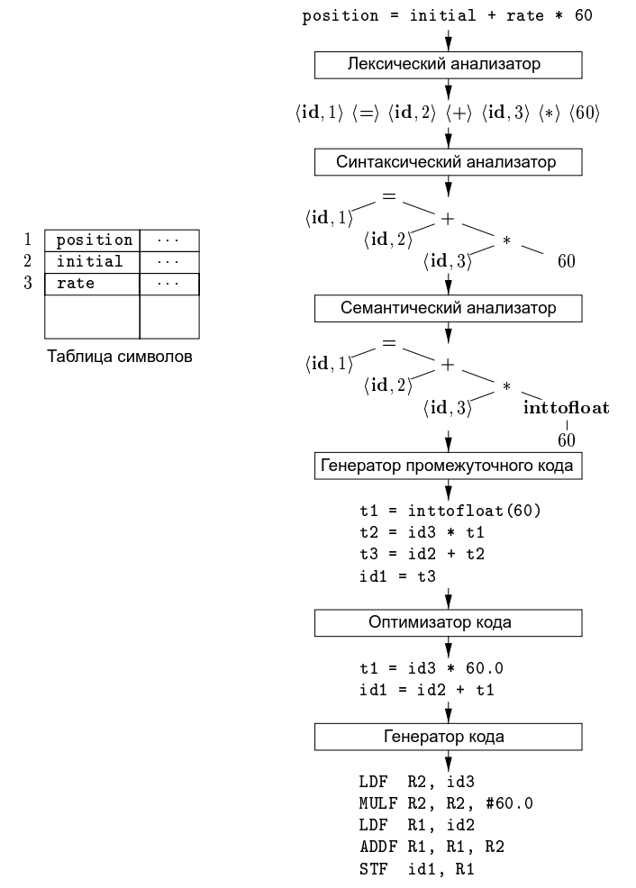
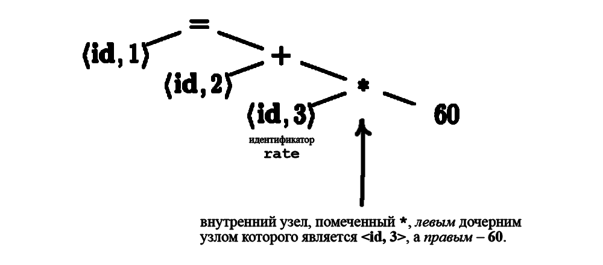

# Введение в компиляторы

## Источники

- [YouTube-канал LLDevLab](https://www.youtube.com/c/LLDevLab)
- [Ахо А. В. Лам Моника С, Сети Рави, Ульман Джеффри Д. Компиляторы: принципы, 
  технологии и инструментарий, 2-е изд.: Пер. с англ //М.: OOO" ИД Вильямc", 
  2008.-1184 с. – 2008](http://www.williamspublishing.com/Books/978-5-8459-1349-4.html)
- [Викиконспекты ИТМО](https://neerc.ifmo.ru/wiki/index.php?title=%D0%97%D0%B0%D0%B3%D0%BB%D0%B0%D0%B2%D0%BD%D0%B0%D1%8F_%D1%81%D1%82%D1%80%D0%B0%D0%BD%D0%B8%D1%86%D0%B0)
- [Wikipedia](https://www.wikipedia.org/)
- [Все что нужно знать о древовидных структурах данных](https://medium.com/nuances-of-programming/%D0%B2%D1%81%D0%B5-%D1%87%D1%82%D0%BE-%D0%BD%D1%83%D0%B6%D0%BD%D0%BE-%D0%B7%D0%BD%D0%B0%D1%82%D1%8C-%D0%BE-%D0%B4%D1%80%D0%B5%D0%B2%D0%BE%D0%B2%D0%B8%D0%B4%D0%BD%D1%8B%D1%85-%D1%81%D1%82%D1%80%D1%83%D0%BA%D1%82%D1%83%D1%80%D0%B0%D1%85-%D0%B4%D0%B0%D0%BD%D0%BD%D1%8B%D1%85-d750444a77ec)

## Теория формальных языков (Formal language theory)

*Формальный язык* состоит из слов, буквы которых взяты из алфавита и 
сформированы в соответствии с определённым набором правил.

(Все языки программирования являются формальными языками, но не все формальные 
языки являются языками программирования).

### Грамматика языка (Formal grammar)

*Грамматика языка (formal grammar)* – это набор правил, описывающих, как 
формировать из алфавита языка строки, соответствующие синтаксису языка.

(Грамматика не описывает значение строк или то, в каком контексте их можно 
использовать, она описывает только то, как строки формируются).

В формальном языке:

- Из букв алфавита формируются *слова* (*words*)
- Из слов формируются *строки* (*strings*)
- Строки формируются в соответствии с *грамматикой языка*

Примеры формальных языков:

*Машинный код* – формальный язык, алфавит которого состоит из двух символов 
$\left\{0, 1\right\}$.

*Язык ассемблера* – формальный язык, алфавит которого состоит из цифр 
$\left\{0 - 9\right\}$, букв латинского алфавита $\left\{a - z, A-Z\right\}$ и 
других символов.

*Компилятор* – это программа, которая транслирует один формальный язык 
(*исходный*) в другой формальный язык (*целевой*).

### Лексемы (Lexemes)

*Лексема* – это оригинальная строка символов, составляющая *токен* (token).

Например, пусть в компиляторе определены следующие токены:

- Токен `число`
- Токен `арифметическая_операция`

В таком случае строка `25 + 30` будет состоять из 3-х лексем и 3-х токенов 
соответственно:

1. Токен `число` с лексемой `25`
2. Токен `арифметическая_операция` с лексемой `+`
3. Токен `число` с лексемой `30`

## $LL$- и $LR$-грамматики

Пример грамматики:

```
1. формула  -> значение + значение
2. значение -> ЧИСЛО
```

Наш пример содержит две *продукции (production)*, обозначенные цифрами 1 и 2.
Продукция состоит из двух частей:

- левой (left-hand side или lhs)
- правой (right-hand side или rhs)

Каждый элемент, входящий в продукцию – это *символ (symbol)*. Символы бывают 
двух типов:

- *Терминалы (terminal symobls)*
- *Нетерминалы (nonterminal symbols)*

**Левая** часть продукции представляет **нетреминал**. Если символ **никогда не 
встречается в левой части** продукции, то это **терминал** (в нашем примере 
грамматики таковыми являются символы `+` и `ЧИСЛО`).

Терминалы – это токены, которые лексический анализатор передаёт парсеру.

Нетерминалы могут включать в себя как терминалы, так и другие нетерминалы.

### Расшифровка $LL(k)$- и $LR(k)$-грамматик:

- $LL$ – **L**eft to right **L**eftmost derivation
- $LR$ – **L**eft to right **R**ightmost derivation 

$k$ – количество символов *предпросмотра (lookahead)* – число, обозначающее, 
сколько символов нужно грамматике, чтобы принять решение о том, какой 
нетерминал в данный момент парсится.

Рассмотрим на примере вышеприведённой грамматики:

```
1. формула  -> значение (левый нетерминал) + значение (правый нетерминал)
2. значение -> ЧИСЛО
```

Если данная грамматика подставит первый пришедший терминал `ЧИСЛО` в **левый**
нетерминал `значение`, то это грамматика с *левосторонним выводом (leftmost 
derivation)*. Если же данная грамматика сначала заменит **правый** нетерминал 
`значение` терминалом `ЧИСЛО`, то это грамматика с *правосторонним выводом
(rightmost derivation)*.

### Символы предпросмотра (Lookahead)

Рассмотрим новую грамматику:

```
формула   -> сложение | умножение
сложение  -> ЧИСЛО + ЧИСЛО
умножение -> ЧИСЛО * ЧИСЛО
```

В данной грамматике нетерминал `формула` может быть либо `сложение`, либо 
`умножение`. При получении первого числа для терминала `ЧИСЛО`, у нас нет 
возможности понять, имеем мы дело со сложением или умножением.

Для того, чтобы понять, какой нетерминал мы парсим, нужно посмотреть следующий 
за первым числом символ, или символ предпросмотра (`+` или `*`).

Так как данной грамматике нужен только один символ предпросмотра, то $k = 1$. 
Иными словами, данная грамматика – либо $LL(1)$, либо $LR(1)$.

### Структура грамматик

Все грамматики имеют структуру дерева.

Если парсер использует $LL$-грамматику, то обход дерева начинается с корня и 
парсер двигается вниз по дереву (top-down parsing).

Если парсер использует $LR$-грамматику, то обход дерева осуществляется от 
листьев до корня (bottom-up parsing).

---

## Структура компилятора

Действия компилятора разделяются на две основные части: *анализ* и *синтез*.

*Анализ* разбивает исходную программу на составные части и накладывает на них 
грамматическую структуру. Он собирает синтаксические и семантические ошибки. 
Анализ также собирает информацию об исходной программе и сохраняет её в 
структуре данных, именуемой *таблицей символов* (*symbol table*).

*Синтез* строит **целевую** программу на основе промежуточного представления и 
таблицы символов из этапа анализа.

Анализ часто называют *frontend'ом* компилятора, синтез – *backend'ом*.

Если рассмотреть процесс компиляции более детально, можно увидеть, что он 
представляет собой последовательность *фаз*:



---

### Лексический анализ

Первая фаза компиляции называется *лексическим анализом*.

Лексический анализатор читает поток символов, составляющих исходную программу, 
и группирует эти символов в значащие последовательности, называющиеся 
*лексемами* (*lexemes*). Для каждой лексемы анализатор строит выходной *токен* 
(*token*) следующего вида:

```
<имя_токена, значение_атрибута>
```

`имя_токена` представляет собой абстрактный символ, использующийся во время 
*синтаксического анализа* (*парсинга*) – следующей фазы компиляции.

`значение_атрибута` указывает на запись в таблице символов, соответствующую 
данному токену.

Пусть, например, исходная программа содержит инструкцию присваивания

```
position = initial + rate * 60
```

Символы в этом присваивании могут быть сгруппированы в следующие лексемы и 
отображены в следующие токены:

1. лексема `position` -> токен `<id, 1>`, где
   
   `id` – абстрактный символ, обозначающий `идентификатор` (имеется ввиду 
   идентификатор переменной), а `1` **указывает на запись в таблице символов** 
   для `position`. Запись таблицы символов для некоторого идентификатора хранит 
   информацию о нём, такую как его имя и тип.
2. лексема `=` -> токен `<=>`. Этот токен не требует значения атрибута, второй 
   компонент данного токена опущен.
3. лексема `initial` -> токен `<id, 2>`.
4. лексема `+` -> токен `<+>`.
5. лексема `rate` -> токен `<id, 3>`.
6. лексема `*` -> токен `<*>`.
7. лексема `60` -> токен `<60>`, но
   
   технически говоря, для лексемы `60` мы должны создать токен наподобие 
   `<number, 4>`.

В итоге получим последовательность токенов

```
<id, 1> <=> <id, 2> <+> <id, 3> <*> <60>
```

---

### Синтаксический анализ (парсинг)

Вторая фаза компиляции называется *синтаксическим анализом* или *парсингом*.

Парсер использует первые компоненты токенов, полученных при лексическом 
анализе

```
<имя_токена, значение_атрибута>
     ^
     |
```

для создания древовидного промежуточного представления (типичным представлением
является *синтаксическое дерево*), которое описывает грамматическую структуру 
потока токенов.

> **Дерево (структура данных). Определения**.
> 
> 
> 
> **Дерево** представляет собой набор объектов, называемых узлами. Узлы 
> соединены рёбрами. Каждый узел содержит значение или данные, и он может иметь 
> или не иметь *дочерний узел*.
> 
> - *Корневой узел* – самый верхний узел дерева (узел *8* на примере).
> - *Корень* – одна из вершин, по желанию наблюдателя.
> - *Лист*, *листовой* или *терминальный узел* – узел, не имеющий дочерних 
>   элементов (узлы *1*, *4*, *7*, *13*).
> - *Внутренний узел* – любой узел дерева, имеющий *потомков*, и таким образом, 
>   не являющий *листовым узлом* (узлы *3*, *6*, *10*, *14*).

В *синтаксическом дереве* каждый внутренний узел представляет операцию, а 
дочерний узел – аргументы этой операции.

Синтаксическое дерево для потока токенов из лексического анализа:



Это дерево указывает порядок, в котором выполняются операции в присваивании 
`position = initial + rate * 60`.



Узел, помеченный `*`, явно указывает, что сначала мы должны умножить значение 
`rate` на `60`. Дальше операции выполняются вверх по дереву.

---

### Семантический анализ

Третья фаза компиляции называется *семантическим анализом*.

Семантический анализатор использует синтаксическое дерево и информацию из 
таблицы символов для проверки исходной программы на семантическую 
согласованность с определением языка.

Семантический анализатор также **собирает** *информацию о типах* и сохраняет её 
в синтаксическом дереве или в таблице символов для последующего использования в 
процессе генерации промежуточного кода.

Важной частью семантического анализа является **проверка типов**. Компилятор 
проверяет, имеет ли каждый оператор операнды соответствующего типа.

> Например, проверяет, является ли индекс массива целым числом.

> Спецификация языка может разрешать определённые преобразования типов, 
> называемые **приведениями** (**coercion**).
> 
> Например, на рисунке выше имеется приведение, представленное дополнительным 
> узлом синтаксического дерева `inttofloat`, который явным образом преобразует 
> свой целый аргумент в число с плавающей точкой.

---

### Генерация промежуточного кода

Четвёртая фаза компиляции называется *генерацией промежуточного кода*

В процессе трансляции исходной программы в целевой код компилятор может 
создавать *множество* промежуточных представлений различного вида.

> Например, синтаксические деревья являются видом промежуточного представления.

После синтаксического и семантического анализа исходной программы многие 
компиляторы генерируют явное низкоуровневое или машинное промежуточное 
представление исходной программы, которое можно рассматривать как программу 
для *абстрактной* вычислительной машины.

---

### Оптимизация кода

Пятая фаза компиляции называется *оптимизацией кода*.

Машинно-независимая оптимизация кода пытается улучшить промежуточный код, 
чтобы затем получить *более качественный* целевой код.

Обычно *более качественный* означает *более быстрый*, но могут применяться и 
другие критерии сравнения, например, *более короткий код* или *код, 
использующий меньшее количество ресурсов*.

---

### Генерация кода (Кодогенерация)

Шестая фаза компиляции называется *генерацией кода* или *кодогенерацией*.

Генератор кода получает в качестве входных данных промежуточное представление 
исходной программы и отображает его в целевой язык.

> Если целевой язык представляет собой машинный код, для каждой переменной, 
> используемой программой, выбираются соответствующие регистры или ячейки 
> памяти.
> 
> Ключевым моментом генерации кода является аккуратное распределение регистров 
> для хранения переменных.

---

### Управление таблицей символов

Важная функция компилятора состоит в том, чтобы записывать имена переменных в 
исходной программе и накапливать информацию о разных атрибутах каждого имени.

Атрибуты могут предоставлять информацию о выделенной памяти для данного имени, 
его типе, области видимости и, в случае имён процедур, такие сведение, как 
количество и типы их аргументов, метод передачи каждого аргумента (например, 
по значению или по ссылке), а также возвращаемый тип.

---

### Объединение фаз в проходы

Фазы связаны с логической организацией компилятора.

При реализации работа разных фаз может быть сгруппирована в **проходы** 
(**passes**), которые считывают входной файл и записывают выходной.

> Например, фазы *frontend*'а (анализа) – лексический анализ, синтаксический 
> анализ (парсинг), семантический анализ и генерация промежуточного кода – 
> могут быть объединены в один *проход*.
> 
> Далее может быть ещё один *backend*-проход, заключающийся в кодогенерации для 
> конкретной целевой машины.

Некоторые наборы компиляторов разработаны так:

- Используют тщательно разработанное промежуточное представление.
- *Различные* *исходные* коды могут транслироваться в *однотипное промежуточное 
  представление* на начальной стадии.
- Заключительная стадия для конкретной целевой машины может использовать такое 
  промежуточное представление, сгенерированное из любого поддерживаемого языка.

При наличии таких наборов можно создавать компиляторы для *различных исходных 
языков* и *одной конкретной целевой машины*, *комбинируя* различные начальные 
стадии с заключительной стадией для этой целевой машины.
