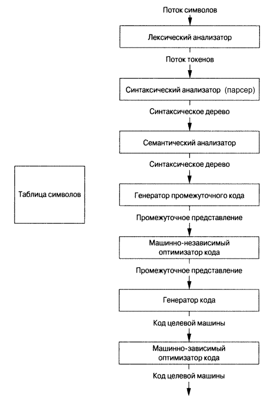

# Введение в компиляторы

## Источники

- [YouTube-канал LLDevLab](https://www.youtube.com/c/LLDevLab)
- [Ахо А. В. Лам Моника С, Сети Рави, Ульман Джеффри Д. Компиляторы: принципы, 
  технологии и инструментарий, 2-е изд.: Пер. с англ //М.: OOO" ИД Вильямc", 
  2008.-1184 с. – 2008](http://www.williamspublishing.com/Books/978-5-8459-1349-4.html)
- [Викиконспекты ИТМО](https://neerc.ifmo.ru/wiki/index.php?title=%D0%97%D0%B0%D0%B3%D0%BB%D0%B0%D0%B2%D0%BD%D0%B0%D1%8F_%D1%81%D1%82%D1%80%D0%B0%D0%BD%D0%B8%D1%86%D0%B0)

## Теория формальных языков (Formal language theory)

*Формальный язык* состоит из слов, буквы которых взяты из алфавита и 
сформированы в соответствии с определённым набором правил.

(Все языки программирования являются формальными языками, но не все формальные 
языки являются языками программирования).

### Грамматика языка (Formal grammar)

*Грамматика языка (formal grammar)* – это набор правил, описывающих, как 
формировать из алфавита языка строки, соответствующие синтаксису языка.

(Грамматика не описывает значение строк или то, в каком контексте их можно 
использовать, она описывает только то, как строки формируются).

В формальном языке:

- Из букв алфавита формируются *слова* (*words*)
- Из слов формируются *строки* (*strings*)
- Строки формируются в соответствии с *грамматикой языка*

Примеры формальных языков:

*Машинный код* – формальный язык, алфавит которого состоит из двух символов 
$\left\{0, 1\right\}$.

*Язык ассемблера* – формальный язык, алфавит которого состоит из цифр 
$\left\{0 - 9\right\}$, букв латинского алфавита $\left\{a - z, A-Z\right\}$ и 
других символов.

*Компилятор* – это программа, которая конвертирует один формальный язык (язык 
$A$) в другой формальный язык (язык $B$).

<center>
  
  <br/>
  Фазы компилятора
</center>

### Лексемы (Lexemes)

*Лексема* – это оригинальная строка символов, составляющая *токен* (token).

Например, пусть в компиляторе определены следующие токены:

- Токен `число`
- Токен `арифметическая_операция`

В таком случае строка `25 + 30` будет состоять из 3-х лексем и 3-х токенов 
соответственно:

1. Токен `число` с лексемой `25`
2. Токен `арифметическая_операция` с лексемой `+`
3. Токен `число` с лексемой `30`

## $LL$- и $LR$-грамматики

Пример грамматики:

```
1. формула  -> значение + значение
2. значение -> ЧИСЛО
```

Наш пример содержит две *продукции (production)*, обозначенные цифрами 1 и 2.
Продукция состоит из двух частей:

- левой (left-hand side или lhs)
- правой (right-hand side или rhs)

Каждый элемент, входящий в продукцию – это *символ (symbol)*. Символы бывают 
двух типов:

- *Терминалы (terminal symobls)*
- *Нетреминалы (nonterminal symbols)*

**Левая** часть продукции представляет **нетреминал**. Если символ **никогда не 
встречается в левой части** продукции, то это **терминал** (в нашем примере 
грамматики таковыми являются символы `+` и `ЧИСЛО`).

Терминалы – это токены, которые лексический анализатор передаёт парсеру.

Нетерминалы могут включать в себя как терминалы, так и другие нетерминалы.

### Расшифровка $LL(k)$- и $LR(k)$-грамматик:

- $LL$ – **L**eft to right **L**eftmost derivation
- $LR$ – **L**eft to right **R**ightmost derivation 

$k$ – количество символов *предпросмотра (lookahead)* – число, обозначающее, 
сколько символов нужно грамматике, чтобы принять решение о том, какой 
нетерминал в данный момент парсится.

Рассмотрим на примере вышеприведённой грамматики:

```
1. формула  -> значение (левый нетерминал) + значение (правый нетерминал)
2. значение -> ЧИСЛО
```

Если данная грамматика подставит первый пришедший терминал `ЧИСЛО` в **левый**
нетерминал `значение`, то это грамматика с *левосторонним выводом (leftmost 
derivation)*. Если же данная грамматика сначала заменит **правый** нетерминал 
`значение` терминалом `ЧИСЛО`, то это грамматика с *правосторонним выводом
(rightmost derivation)*.

### Символы предпросмотра (Lookahead)

Рассмотрим новую грамматику:

```
формула   -> сложение | умножение
сложение  -> ЧИСЛО + ЧИСЛО
умножение -> ЧИСЛО * ЧИСЛО
```

В данной грамматике нетерминал `формула` может быть либо `сложение`, либо 
`умножение`. При получении первого числа для терминала `ЧИСЛО`, у нас нет 
возможности понять, имеем мы дело со сложением или умножением.

Для того, чтобы понять, какой нетерминал мы парсим, нужно посмотреть следующий 
за первым числом символ, или символ предпросмотра (`+` или `*`).

Так как данной грамматике нужен только один символ предпросмотра, то $k = 1$. 
Иными словами, данная грамматика – либо $LL(1)$, либо $LR(1)$.

### Структура грамматик

Все грамматики имеют структуру дерева.

Если парсер использует $LL$-грамматику, то обход дерева начинается с корня и 
парсер двигается вниз по дереву (top-down parsing).

Если парсер использует $LR$-грамматику, то обход дерева осуществляется от 
листьев до корня (bottom-up parsing).
